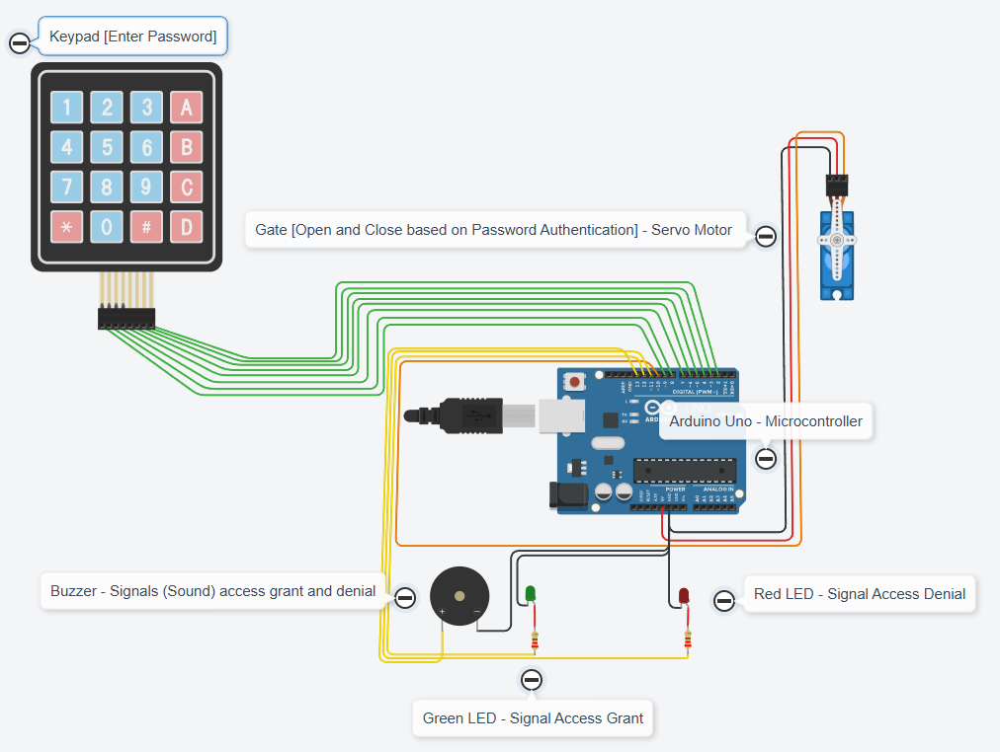
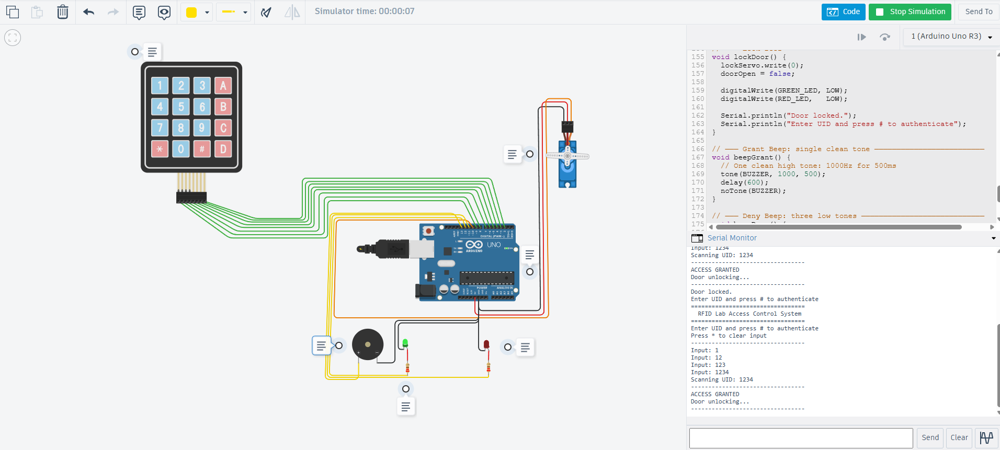
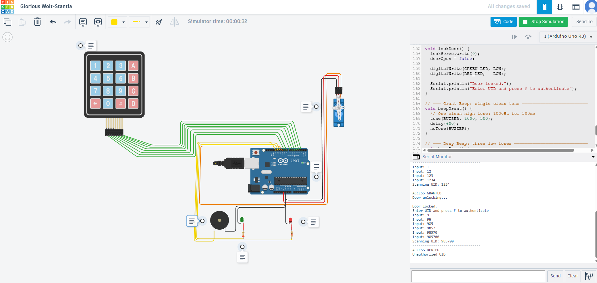

# Keypad-Based Lab Access Control System

## Overview

This project implements a credential-based authentication system 
for controlling access to a restricted area such as a university 
lab or secure facility. The system reads a user-entered credential 
(UID code), validates it against a list of authorized entries 
stored in the microcontroller, and grants or denies access 
accordingly through physical actuators and audio-visual feedback.

The system is built and simulated using Tinkercad Circuits with 
an Arduino UNO and a 4x4 keypad as the credential input device. 
The core authentication logic, access control flow, and hardware 
response mechanisms are directly transferable to wireless 
credential systems including RFID (RC522), NFC, and Bluetooth-based 
access control, where the keypad input is replaced by a wireless 
reader that passes the credential UID to the same validation logic.

---

## System Architecture
Credential Input (Keypad / RFID / NFC / Bluetooth)
↓
Input Handler (Keypad or Wireless Reader Module)
↓
Arduino UNO (UID validation)
↓
Authorized          Unauthorized
↓                   ↓
Green LED            Red LED
Short beep         Three beeps
Servo unlocks      Door stays locked
Auto locks (5s)

---

## Components

| Component | Purpose |
|---|---|
| Arduino UNO | Main microcontroller, UID validation logic |
| 4x4 Keypad | Credential input device (UID entry) |
| Servo Motor | Physical lock mechanism |
| Green LED | Access granted indicator |
| Red LED | Access denied indicator |
| Piezo Buzzer | Audio feedback |
| 2x 220 ohm Resistors | LED current limiting |

---

## Pin Configuration

| Component | Arduino Pin |
|---|---|
| Keypad Row 1-4 | Pins 9, 8, 7, 6 |
| Keypad Col 1-4 | Pins 5, 4, 3, 2 |
| Servo Signal | Pin 10 |
| Red LED | Pin 11 |
| Green LED | Pin 12 |
| Buzzer | Pin 13 |
| Servo Power | 5V |
| GND (all) | GND |

---

## Authentication Logic

The system stores authorized credential UIDs directly in the 
microcontroller. The same validation logic applies to any 
credential input method. In a physical wireless deployment, 
an RFID RC522 reader, NFC module, or Bluetooth receiver reads 
the credential from a card, tag, or device and passes the UID 
string to the same Arduino validation function shown below.

```cpp
const String AUTHORIZED_UIDS[] = {"1234", "5678"};
const int NUM_AUTHORIZED = 2;

bool checkUID(String uid) {
  for (int i = 0; i < NUM_AUTHORIZED; i++) {
    if (uid == AUTHORIZED_UIDS[i]) {
      return true;
    }
  }
  return false;
}
```

### Access Granted Flow
1. UID matches an authorized entry
2. Green LED activates
3. Single high tone (1000Hz, 500ms)
4. Servo rotates to 90 degrees (unlocked)
5. Door auto locks after 5 seconds

### Access Denied Flow
1. UID does not match any authorized entry
2. Red LED activates
3. Three low tones (300Hz, 300ms each)
4. Servo remains at 0 degrees (locked)
5. Red LED deactivates after 4 seconds

---

## Circuit Diagram



## Simulation

### Access Granted


### Access Denied


---

## How to Run the Simulation

1. Open the Tinkercad project link: (add your link here)
2. Click Start Simulation
3. Open the Serial Monitor
4. Enter a UID using the keypad
5. Press # to authenticate
6. Press * to clear input

**Test cases:**
- Enter `1234#` for authorized access
- Enter `5678#` for second authorized card
- Enter `0000#` for unauthorized access attempt

---

## Security Considerations

This implementation stores UIDs in plaintext in the 
microcontroller firmware. A production deployment would require:

- Encrypted UID storage
- Secure communication between reader and controller
- Anti-replay protection against UID spoofing
- Audit logging of all access attempts
- Tamper detection on the hardware enclosure

These limitations reflect an active research area in 
physical-layer security for IoT and RFID systems.

---

## Connection to Security Research

Credential-based authentication systems face several attack 
surfaces that are the subject of active academic research:

- **Eavesdropping:** passive capture of wireless signals to 
  clone credentials
- **Relay attacks:** forwarding signals to extend effective 
  read range beyond intended boundaries
- **Side-channel attacks:** inferring credentials from power 
  or timing patterns
- **Sensing-based inference:** using passive RFID arrays to 
  infer user behavior without direct card interaction

This project builds foundational understanding of the authentication logic that such attacks target.
